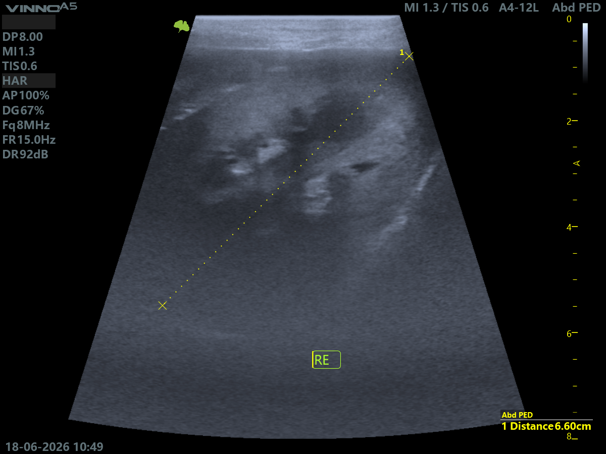

# Us.Vet.Imagens.Anonimizador

**MVP open source para anonimização de imagens ultrassonográficas veterinárias.**

O **Us.Vet.Imagens.Anonimizador** é um projeto desenvolvido para auxiliar na remoção de dados sensíveis presentes em imagens ultrassonográficas veterinárias, como nome do paciente, tutor, ID do exame, data, clínica ou outras informações exibidas na tela do aparelho.

A proposta surgiu a partir da rotina em diagnóstico por imagem veterinário, especialmente na ultrassonografia de cães e gatos, onde imagens clínicas podem conter informações identificáveis. O projeto busca criar uma solução simples, acessível e aplicável para preparar imagens com mais segurança antes de uso em estudo, documentação técnica, banco de imagens, portfólio acadêmico ou projetos futuros de análise de dados e inteligência artificial.

---

## Objetivo do projeto

Criar um MVP capaz de anonimizar imagens ultrassonográficas veterinárias por meio de processamento de imagem, preservando a região diagnóstica e removendo áreas com dados sensíveis.

Nesta primeira versão, o sistema permite aplicar uma tarja automática em regiões específicas da imagem, com foco inicial no canto inferior direito, onde determinados aparelhos exibem nome do paciente, tutor e ID do exame.

---

## Problema

Na rotina de ultrassonografia veterinária, as imagens dos exames muitas vezes contêm dados sensíveis incorporados diretamente na imagem.

Isso dificulta o uso seguro dessas imagens para:

- estudo;
- ensino;
- organização de casuística;
- trabalhos acadêmicos;
- construção de banco de imagens;
- portfólio técnico;
- pesquisa;
- aplicações futuras de visão computacional.

Além disso, a anonimização manual pode ser demorada, repetitiva e sujeita a falhas.

---

## Solução proposta

O projeto utiliza Python e bibliotecas de processamento de imagem para aplicar anonimização automática em áreas configuráveis da imagem.

A primeira versão do MVP permite:

- carregar uma imagem ultrassonográfica;
- definir regiões sensíveis;
- aplicar tarja preta, desfoque ou pixelização;
- preservar a maior parte da imagem diagnóstica;
- visualizar o resultado antes e depois;
- baixar a imagem anonimizada.

---

## Funcionalidades do MVP

- Upload de imagem no Google Colab.
- Leitura da imagem com Python.
- Conversão da imagem para processamento.
- Anonimização por região.
- Máscara seletiva no canto inferior direito.
- Ajuste da largura e altura da faixa de anonimização.
- Visualização comparativa antes/depois.
- Download da imagem anonimizada.
- Estrutura inicial para evolução futura em lote e interface web.

---

## Tecnologias utilizadas

- Python
- Google Colab
- OpenCV
- Pillow
- NumPy
- Matplotlib

---

## Como usar no Google Colab

1. Abra o notebook do projeto no Google Colab.
2. Execute a célula de importação das bibliotecas.
3. Envie uma imagem ultrassonográfica de teste.
4. Execute a célula de carregamento da imagem.
5. Aplique a função de anonimização do canto inferior direito:

```python
imagem_anonimizada = anonimizar_canto_inferior_direito(
    imagem_original,
    modo="tarja",
    largura_percent=55,
    altura_percent=3
)

mostrar_antes_depois(imagem_original, imagem_anonimizada)
```

6. Revise visualmente o resultado.
7. Baixe a imagem anonimizada.

A configuração inicial recomendada é `largura_percent=55` e `altura_percent=3`, pois ela cobre apenas a linha inferior direita onde aparecem dados sensíveis, preservando medidas e informações técnicas relevantes do exame.

---

## Exemplo de aplicação

O MVP foi testado em imagem ultrassonográfica veterinária contendo dados sensíveis no rodapé direito da tela.

A primeira abordagem com tarja ampla cobria também dados técnicos relevantes, como medidas do exame. Após ajuste, a solução passou a aplicar uma máscara mais fina e localizada, removendo nome, tutor e ID, sem prejudicar a região diagnóstica principal.

<p align="center">
  
</p>

<p align="center">
  <em>Exemplo de imagem ultrassonográfica veterinária após anonimização seletiva no rodapé direito.</em>
</p>

Esse processo reforça a importância de uma anonimização configurável, validada visualmente e adaptável ao padrão de cada equipamento.

---

## Estrutura atual do projeto

```text
Us.Vet.Imagens.Anonimizador/
├── app/
│   └── anonimizador.py
├── notebooks/
│   └── UsVet_Anonimizador_MVP.ipynb
├── LICENSE
├── README.md
├── imagem_anonimizada.png
└── requirements.txt
```

---

## Próximas evoluções

- Processamento em lote de múltiplas imagens.
- Perfis de anonimização por modelo de aparelho.
- Seleção manual de áreas sensíveis.
- Interface web com Streamlit.
- Exportação automática em `.zip`.
- Remoção de metadados.
- Registro de histórico de processamento.
- Organização de banco de imagens anonimizado.
- Classificação futura por espécie, órgão e achado ultrassonográfico.
- Possível uso de OCR para detecção automática de textos sensíveis.

---

## Cuidados com privacidade

Este projeto não substitui revisão humana.

Antes de publicar, compartilhar ou utilizar uma imagem em contexto acadêmico, profissional ou público, é necessário revisar visualmente se todos os dados sensíveis foram removidos.

Não devem ser publicados no GitHub:

- nome do tutor;
- nome do paciente;
- nome da clínica;
- telefone;
- endereço;
- número de prontuário;
- ID real do exame;
- imagens clínicas identificáveis;
- dados pessoais ou profissionais visíveis.

Para demonstração pública, recomenda-se utilizar apenas imagens fictícias, simuladas ou previamente anonimizadas.

---

## Possíveis aplicações

- Organização de banco pessoal de imagens ultrassonográficas.
- Apoio a estudos em diagnóstico por imagem veterinário.
- Preparação de imagens para aulas e apresentações.
- Projetos acadêmicos em Análise e Desenvolvimento de Sistemas.
- Portfólio técnico em VetTech e HealthTech.
- Base futura para estudos com visão computacional e IA aplicada.

---

## Status do projeto

MVP inicial funcional em Google Colab.

A primeira versão realiza anonimização seletiva de regiões sensíveis em imagens ultrassonográficas veterinárias.

---

## Autora

**Yasmine Santos**  
Estudante de Análise e Desenvolvimento de Sistemas pelo IFRS  
Médica-veterinária especialista em Diagnóstico por Imagem  
Interesses: VetTech, HealthTech, processamento de imagens, dados, automação, IA aplicada e desenvolvimento de soluções digitais para problemas reais.

LinkedIn: https://www.linkedin.com/in/yasmine-santos-594a7a140  
GitHub: https://github.com/yasmine-vet-ads

---

## Licença

Este projeto está licenciado sob a licença MIT.
