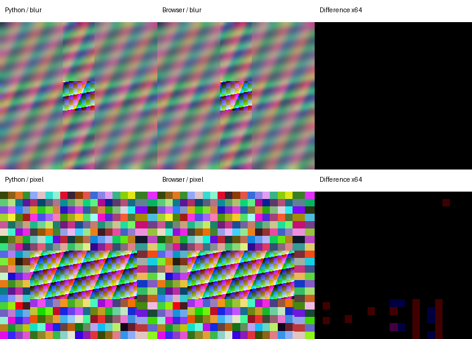

# Prova de conceito — Image Anonymizer client-side

## Base e escopo

Base obrigatória confirmada após `git fetch`: `origin/develop = dd8513c9fd227ad64e0eff7e7010a93be500ef5f`.

Branch: `codex/anonymizer-client-poc`.
Worktree isolado: `C:\Users\USER\.codex\worktrees\anonymizer-client-poc\Us.Vet.Imagens.Anonimizador`.

A POC está inteiramente em `browser-poc/`; documentação e evidências ficam em `docs/`. Nenhum arquivo Python, teste da referência, requirement, README original ou configuração Streamlit foi modificado. Não houve integração com Next.js, deploy, mudança jurídica, push ou PR. Main e develop não foram modificadas.

A referência inspecionada nesta base é `app/main.py`, `app/fluxo.py` e `app/anonimizador.py`. O fluxo público validado usa `decodificar`, `validar_lote`, `processar_lote`, `anonymize_image`, `image_to_bytes`, nomes neutros e ZIP condicionado à revisão. Não usa `anonimizar_canto_inferior_direito` nem `salvar_sem_metadados`: estas funções não foram incorporadas à POC.

## Arquitetura

Seleção File API → validação estrutural e decodificação sequencial → Dedicated Worker → máscaras em RGB → PNG RGB local → comparação Original × Anonimizada → declaração humana global → ZIP local → download via Blob URL.

- `src/core.ts`: limites, round half-to-even, regiões ordenadas, tarja, Gaussian separável e pixelização explícita.
- `src/codec.ts`: assinatura/estrutura/CRC PNG, PNG estático com filtros e Adam7, RGB sem premultiplicação, JPEG sanitizado antes de decodificação nativa, encoder PNG RGB, ZIP STORE.
- `src/worker.ts`: validação, processamento, encoding e ZIP. Recebe ArrayBuffers transferidos, não nomes.
- `src/state.ts`: processingRevision/outputRevision/reviewedRevision.
- `src/main.ts`, HTML/CSS: seleção local, remoção/ordem, configurações, status neutro, revisão e confirmação.
- `scripts/serve.mjs`: servidor de **assets estáticos** em 127.0.0.1:4173, sem endpoint de upload, leitura de corpo ou processamento de imagens. GET/HEAD apenas; outros métodos recebem 405.
- `scripts/audit.mjs`: auditoria reproduzível de APIs de rede/armazenamento, dependências e servidor.
- `tests/`: fixtures sintéticas, comparação com Python, matriz real dos navegadores, privacidade, offline, performance e stress.

O Worker precisa ser carregado antes do teste offline. A POC usa CompressionStream/DecompressionStream deflate nativos. Sem essas APIs, não está no corpus de navegadores suportado. Não há polyfill pesado.

Para JPEG, a POC usa createImageBitmap com imageOrientation="none", colorSpaceConversion="none", premultiplyAlpha="none", Canvas 2D e ImageData. Como proteção adicional, remove APP/COM antes de decodificar, incluindo EXIF e ICC. Uma tentativa alternativa com "from-image" só ocorre sobre JPEG já sem EXIF. O fallback para Canvas DOM é usado se OffscreenCanvas não existir; convolução, encoding e ZIP continuam no Worker. Esse fallback é forçado e verificado nos testes adicionais.

No Firefox testado, um Blob JPEG formado por vários segmentos retornou InvalidStateError na decodificação; consolidar os segmentos em um Blob contíguo resolveu. Isso acrescenta uma cópia temporária bounded do JPEG sanitizado, sem alterar pixels/metadata.

## Dependências e bundle

**Zero dependências de runtime.** Não foi adicionado fflate. APIs nativas não oferecem um writer ZIP; um encoder mínimo de ZIP STORE é suficiente para até 10 PNGs e dispensa recompressão. CRC-32, cabeçalhos locais, diretório central, EOCD e nomes neutros são verificados, inclusive por ZipFile do Python na inspeção visual. PNG usa deflate nativo e não o encoder Canvas. Compressão PNG pode variar entre engines; estrutura e pixels são o contrato, não identidade binária dos arquivos.

Ferramentas de desenvolvimento isoladas e fixadas em package-lock.json:

| Ferramenta | Finalidade | Licença | Pacote npm descompactado | Inclusão no runtime |
|---|---|---|---:|---|
| esbuild 0.25.10 | Bundle local JS | MIT | 135.343 bytes, além do binário por plataforma | Nenhuma |
| TypeScript 5.9.3 | Checagem de tipos | Apache-2.0 | 23.625.066 bytes | Nenhuma |
| Playwright 1.56.1 | Navegadores/testes | Apache-2.0 | 3.876.495 bytes, além de playwright-core/browsers | Nenhuma |

Essas ferramentas não acompanham os assets servidos. A referência comparativa usa ambiente .venv isolado, requisitos em tests/requirements-reference.txt; Python nunca roda no navegador nem no servidor estático. Navegadores baixados, node_modules, venv, fixtures geradas e artefatos locais são ignorados no Git. Tamanhos finais dos assets constam em anonymizer-client-poc-evidence/summary.json.

## Funcionalidades e estado

Preservados: PNG/JPG/JPEG, lote de 1–10, erros de validação bloqueando todo o lote, falha inesperada isolando só um item, nomes Item 001 etc., três modos, percentuais inteiros de 0–40, defaults 4/4/0/0, ordem superior → inferior → esquerda → direita, comparação de todas as imagens, confirmação global e ZIP somente após confirmação.

O nome original é usado somente para determinar a extensão, na seleção local. O seletor é limpo depois de obter as referências File. Nomes originais não aparecem em mensagens públicas, logs da aplicação, filenames de saída ou nomes internos do ZIP. O nome ZIP é usvet_imagens_anonimizadas.zip; entradas são imagem_anonimizada_NNN.png, com índice da posição no lote (lacunas após falha isolada são preservadas, como Python).

Mudanças de arquivo, ordem, remoção, modo ou qualquer faixa descartam saídas e confirmação. Reprocessar também exige nova confirmação. A UI bloqueia mudanças enquanto trabalha; não permite concorrência entre lotes. A falha de item é exibida e excluída do ZIP; a declaração humana cobre todos os resultados com sucesso, como a referência.

As comparações estão disponíveis para todos os itens, em um accordion que mantém apenas uma dupla decodificada por vez. Em desktop ficam lado a lado; no viewport estreito ficam verticais. Inspeção em resolução completa com rolagem preserva acesso a todos os pixels. Nenhuma imagem é reduzida na exportação. Não existe download individual nem funcionalidade de anonimização nova.

## Validação e limites

Não confia em accept, File.type ou extensão isolada. Compara extensão, assinatura real, estrutura, dimensões e decodificação integral.

PNG: assinatura, IHDR primeiro, comprimentos, CRC de todos os chunks, chunks críticos conhecidos, paleta válida, IDAT contíguo, IEND, inflate limitado ao comprimento previsto e filtros 0–4. Rejeita acTL/fcTL/fdAT, inclusive APNG com imagem default. Suporta PNG estático nos tipos 0/2/3/4/6 e depths válidos; testes adicionais cobrem 1/2/4/8/16 bits e Adam7. Descarta alpha/tRNS sem composição, preservando RGB oculto como Pillow convert("RGB").

JPEG: SOI, markers/segments limitados, SOF antes dos scans, dimensões, EOI final, extensão consistente e decodificação nativa. Suporta SOF0/SOF1/SOF2 de 8 bits cinza ou três componentes. Corrupção de entropy que um decoder nativo recupera pode diferir do comportamento Pillow; o corpus de corrupção não prova rejeição universal de todo bitstream malformado.

Limite Python observado: Pillow Image.MAX_IMAGE_PIXELS = **89.478.485**, com DecompressionBombWarning convertido em erro pelo fluxo. Limite da POC: **12.000.000 pixels**, **8192 por lado**, **64 MiB de entrada por item**, antes de inflate/bitmap/canvas. Não foi copiado o limite do servidor para dispositivos móveis.

Justificativa do orçamento: 12 MP já atende o stress solicitado. Um RGB usa 36 MB e um RGBA usa 48 MB; PNG multicanal de 16 bits pode inflar até cerca de 96 MB, além dos buffers de entrada. Convolução usa cópias da ROI, buffer horizontal Uint16 e saída Uint8; são liberáveis após cada região. 8192 evita imagens muito alongadas/limites de Canvas dependentes do dispositivo; 64 MiB limita entrada e trabalho de inspeção. O limite é uma política conservadora de **POC**, não garantia de ausência de OOM em mobile. O corpus funcional aprovado aqui é 1600×1200 em desktop; produção mobile aguarda dispositivos reais.

## Pixels, orientação, blur e pixelização

Sem correção silenciosa de orientação. A referência não chama exif_transpose; fixtures EXIF 1–8 usam o mesmo JPEG de entrada e comparam dimensões/pixels contra decodificar/anonymize_image/image_to_bytes. A sondagem separada do comportamento nativo "none" está nos relatórios adicionais. A remoção explícita de EXIF assegura coordenadas sem orientação mesmo se a opção variar entre engines.

PNGs são decodificados explicitamente para evitar perda de RGB oculto por premultiplicação de alpha em Canvas. Cinza puro 16 bits acompanha a saturação Pillow I;16 → RGB; cinza+alpha e RGB(A) 16 bits usam byte alto. Paletas e alpha transparente são normalizados para RGB sem fundo composto. JPEG é decodificado nativamente sem ICC, com diferenças quantitativas permitidas e medidas.

Tarja escreve R=G=B=0 em toda a região. Percentuais usam half-to-even, inclusive início inferior/direito calculado com (100-percent), sem substituir por width-round(width*percent).

Blur: kernel max(21, 2*floor(min(altura,largura)/8)+1); sigma .3*((kernel-1)*.5-1)+.8. Convolução separável, borda REFLECT_101 isolada na ROI, kernel simétrico quantizado para soma 256 por difusão de erro, horizontal Uint16 e arredondamento final de 16 bits. Foi necessário reproduzir a quantização do caminho uint8 do OpenCV; usar só floats falhava a média em uma fixture de 1 bit. Não usa Canvas filter.

Pixelização: dimensão reduzida max(1,floor(dim/12)), bilinear explícito com coordenadas half-pixel, seguida de nearest floor(coord*dimReduzida/dimOriginal). Não depende de Canvas smoothing. Pode diferir em 1 nível do arredondamento fixed-point de INTER_LINEAR; medição e tolerância estão nos relatórios.

Tolerâncias definidas antes de GO:

| Gate | Máximo por canal | Média |
|---|---:|---:|
| Normalização PNG, dimensões, tarjas | 0 | 0 |
| Blur/pixelização PNG vs Python | ≤2 | ≤0,5 |
| Decoder JPEG vs Pillow | ≤3 | ≤0,5 |
| Pipeline JPEG + processamento acumulado | ≤5 | ≤0,7 |

Erro de borda (faixa externa de 10 pixels) é registrado separadamente. Identidade de bytes PNG/ZIP não é requisito. As evidências incluem comparação visual Python/browser/diferença amplificada, inspeção de layouts e relatórios por caso.

## PNG RGB e metadados

Saída construída do zero: assinatura PNG, dimensões corretas, bit depth **8**, color type **2**, somente **IHDR/IDAT/IEND**, CRC válido. Nenhum PNG RGBA é aceito no gate de saída. As saídas Canvas nativas são analisadas na sondagem adicional; o fluxo da POC usa seu encoder RGB em todos os browsers, independentemente dessa sondagem.

Fixtures JPEG incluem EXIF ImageDescription/Artist/DateTime/GPS/UserComment, XMP APP1, ICC APP2 e COM. Fixtures PNG incluem tEXt, iTXt, zTXt, eXIf, iCCP, pHYs, tIME e XMP iTXt. Sentinels: PATIENT_TEST_123, OWNER_TEST_456, CLINIC_TEST_789, PRIVACY_TEST_7F2A9C e PACIENTE-TESTE-PRIVACIDADE-7F2A9C. A análise binária verifica chunks, ausência de sentinels e nomes originais na saída/ZIP; os arquivos originais nunca são empacotados.

Conclusão restrita às evidências: **nenhum metadado identificador da entrada foi propagado nos casos testados**. Os campos técnicos IHDR/IDAT/IEND são necessários ao PNG; não se afirma genericamente "PNG sem qualquer metadado".

## Privacidade, rede, offline e armazenamento

Auditoria de src/HTML/CSS: nenhuma API route, Server Action, multipart, SDK de upload, serviço clínico remoto, Cloudinary, Supabase, OpenAI, WebSocket de processamento ou analytics. O único servidor serve assets locais; não existe backend de processamento.

Testes Playwright instrumentam fetch, XMLHttpRequest, sendBeacon, WebSocket e FormData na página e no Worker. Interceptação global de requests autoriza somente os GETs iniciais dos quatro assets; qualquer outra tentativa falha. Isso cobre nomes/sentinels/File/Blob/ArrayBuffer/ZIP saindo por request, e qualquer POST/PUT/PATCH de processamento. O sentinel de privacidade está no nome e no conteúdo de uma fixture sintética. Depois do carregamento inclusive do Worker, o contexto fica offline antes de selecionar/processar/revisar/baixar.

Sem localStorage, IndexedDB, Cache Storage, OPFS ou File System Access para imagens. A aplicação não implementa persistência; referências File/Blob ficam na sessão e são descartadas ao limpar/alterar/sair. Não se afirma que pixels nunca tocam disco: caches internos, swap, backing de Blob e o download explícito são decisões do browser/SO.

CSP: connect-src 'none', form-action 'none', worker/script/style 'self', img-src blob:, default-src 'none'. Isso é proteção adicional; o gate de rede depende também de observar tentativas, não apenas de bloquear transferências.

## Memória e performance

Validação e processamento são sequenciais, nunca Promise.all das imagens. Imagens completas não ficam todas decodificadas. Buffers de entrada são transferidos ao Worker; bitmap.close roda em finally; Canvas é reinicializado para 1×1; RGB/ImageData/temporários deixam de ser referenciados ao terminar o item. PNG/ZIP comprimidos continuam em Blobs para revisão/download; garbage collection e backing store pertencem ao navegador.

Revisão mantém no máximo uma dupla original/saída decodificada; URLs são revogadas ao trocar comparação, invalidar/limpar ou sair. ZIP URL é revogada ao invalidar ou após 30 segundos do download; o teste verifica igualdade entre URLs criadas/revogadas ao limpar. Todas as configurações e nomes são locais.

Gate funcional separado do stress: 1/5/10 × 1600×1200 em tarja, blur e pixelização; stress: 1/5/10 × 4000×3000 em tarja default. São registrados validação, processamento total, tempo por item (decode/máscaras/encode), ZIP, fluxo automatizado completo, scheduling lag, long tasks quando disponíveis, erros e crashes. O fluxo automatizado não mede duração de uma revisão humana.

Heap Chromium é somente JS principal e não representa RSS total, buffers nativos/Worker, GPU ou backing stores de Blob. Firefox pode não expor essa métrica. Ausência de crash desktop não certifica mobile. Stress com configurações extremas de blur não foi aprovado para produção. Resultados numéricos finais e browsers estão no resumo/evidências abaixo.

## Testes e reprodução

Ver [browser-poc/tests/README.md](../browser-poc/tests/README.md). Cobertura: 0/1/5/10/11, PNG/JPG/JPEG, extensão falsa/incompatível, vazio, corrupção/CRC/zlib, truncamento PNG/JPEG, APNG sintético e real, dimensão excessiva, quatro faixas/combinação/.5, tarja/blur/pixel, RGB/RGBA/alpha parcial/RGB oculto, cinza/paleta/depths/Adam7, EXIF 1–8, metadata sentinels, nomes neutros, falha de item, remoção/ordem/configuração/reprocessamento, revisão/confirmação, ZIP 1/10, rede e offline.

Os testes originais Python são executados sem alterações. O ambiente Streamlit 1.50 não reconhecia a chave image dos testes da interface; com Streamlit 1.65 a suíte original passa. O corpus inicial foi gerado com Pillow 12.3 e o adicional com 11.3; ambos usam OpenCV 4.12.0 e NumPy 2.2.6. requirements-reference.txt permite reproduzir todo o corpus com Pillow 11.3 e Streamlit 1.65.

## Checklist humano e limites para produção

- [ ] Chrome Android real: 1/5/10 × 1600×1200 em todos os modos, UI responsiva e sem crash/OOM.
- [ ] Safari desktop real: codecs, EXIF 1–8, alpha oculto, PNG RGB, ZIP, revisão/invalidação, rede/offline.
- [ ] Safari iOS real: mesmos gates, seleção/download ZIP e memória do corpus funcional.
- [ ] Rever todas as comparações, inclusive cantos sobrepostos e a região diagnóstica; testar texto sintético legível sob blur/pixelização.
- [ ] Abrir cada item em resolução completa e comparar com os PNGs Python.
- [ ] Testar reordenação, remoção, troca de arquivos e máscaras; verificar que ZIP fica bloqueado até reprocessar e confirmar.
- [ ] Depois de carregar, desligar rede e completar fluxo; inspeção DevTools sem tráfego de processamento.
- [ ] Abrir ZIP de 1 e 10 itens em Windows/macOS/mobile; conferir todos os nomes neutros.
- [ ] Avaliar pressão de memória de JPEG/PNG pouco compressíveis, não apenas o padrão sintético.
- [ ] Decidir explicitamente suporte a CMYK/YCCK/JPEG incomum e corpus/limite de produção; não assumir paridade universal.
- [ ] Não substituir nem publicar a referência Python antes de aprovação técnica e humana.

Classificação preliminar: **GO COM RESSALVAS** para avaliação humana da POC no corpus desktop testado. Não é autorização de deploy nem substituição da implementação Python. Safari, Android/iOS reais e orçamento de memória total continuam pendentes; JPEG incomum é rejeitado. A documentação não declara reprodução integral de toda imagem que Pillow aceita.

## Referências técnicas

- [OpenCV Gaussian e quantização uint8, versão 4.12](https://github.com/opencv/opencv/blob/4.12.0/modules/imgproc/src/smooth.dispatch.cpp).
- [createImageBitmap e opções de orientação](https://developer.mozilla.org/en-US/docs/Web/API/Window/createImageBitmap).
- [CompressionStream deflate](https://developer.mozilla.org/en-US/docs/Web/API/CompressionStream/CompressionStream).

## Resultados locais e evidências

Gates concluídos em 06/10/2026: 42 testes originais Python, 6 grupos core (116 comparações PNG e 101.000 cálculos de rounding), 28 fixtures válidas/14 inválidas e **156 comparações por navegador (468 no total)**. Verificação independente Pillow/OpenCV dos ZIPs: **144 PNGs funcionais + 48 PNGs de stress**.

Normalização, dimensões, tarjas e blur: erro **0** no corpus comparado. Pixelização: máximo **1**, maior média por fixture **0,253242**, máximo de borda **1**. No corpus 1600×1200, maior média **0,000525**. O decoder JPEG e EXIF 1–8 ficaram exatos nas fixtures testadas. Não se generaliza essa identidade a todos os JPEGs.

PNG final: RGB, 8 bits, tipo 2, apenas IHDR/IDAT/IEND. Metadata/nomes originais/sentinels ausentes. Zero tentativas de request/API de processamento em página e Worker; fluxo completo offline passou nos três navegadores. URLs criadas/revogadas ficaram iguais ao limpar.

**Sondagem nativa crítica:** Canvas produziu PNG tipo 6 (RGBA) nos três browsers. Em Chrome/Edge, imageOrientation="none" sobre JPEG original com EXIF 5–8 mudou 125×75 para 75×125; Firefox manteve 125×75. A POC remove EXIF antes do decoder e encoda RGB explicitamente; seus outputs 1–8 foram pixel-equivalentes ao Python. Fallback Canvas DOM forçado: erro 0 nos três engines, no JPEG sintético pequeno.

| Navegador testado | Tarja 10×1,92 MP | Blur 10×1,92 MP | Pixel 10×1,92 MP | Stress tarja 1/5/10×12 MP |
|---|---:|---:|---:|---|
| Chrome 155.0.8059.27 | 5.88 s | 10.95 s | 5.86 s | 3.60 s / 17.73 s / 34.94 s |
| Edge 154.0.4258.53 | 6.20 s | 11.36 s | 6.35 s | 3.76 s / 17.71 s / 38.22 s |
| Firefox 142.0.1 | 13.05 s | 15.97 s | 14.74 s | 7.42 s / 37.43 s / 75.27 s |

Tempos da tabela são processamento (validação/ZIP/fluxo completo e tempos por item constam nos JSONs). Nenhum erro ou crash nos corpus desktop. Não houve long task registrada no corpus funcional; scheduling lag e heap principal, quando mensuráveis, estão no relatório. O heap principal não mede memória total. Stress e dispositivos reais não são equivalentes a aprovação mobile.

Memória mensurável: máximo de heap JS principal 5160518 bytes; memória total não medida. Atraso máximo de agendamento: 64.0 ms no gate funcional e 343.8 ms no stress. A UI continuou atualizando status/progresso e aceitou revisão/download; atrasos do stress podem ser perceptíveis. São medições headless, não avaliação humana de fluidez em dispositivos reais.

Bundle runtime JS: 21023 bytes sem gzip (main+worker), zero dependências de runtime. Ferramentas de build/teste ficam fora do bundle.

[Resumo estruturado e lista de arquivos](anonymizer-client-poc-evidence/summary.json) · [matriz funcional](anonymizer-client-poc-evidence/browser-report.json) · [gates adicionais](anonymizer-client-poc-evidence/extra-report.json) · [stress separado](anonymizer-client-poc-evidence/stress-report.json) · [auditoria de runtime](anonymizer-client-poc-evidence/audit.json).

Classificação final preliminar da POC: **GO COM RESSALVAS**, pronta para teste humano do corpus documentado; nenhuma liberação para produção/mobile ou substituição Python foi declarada.
